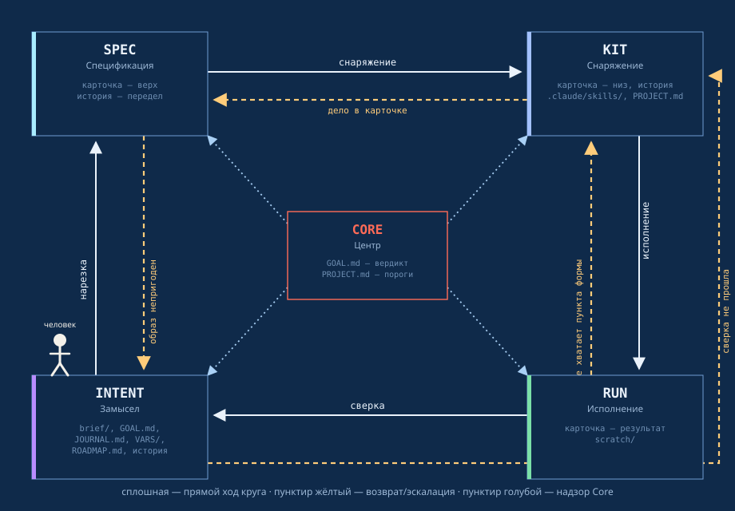
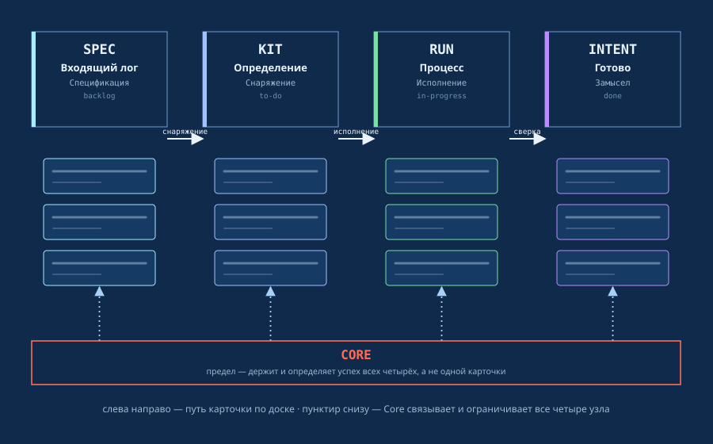

# Forma

A Claude Code plugin: a five-node project management protocol — `Intent` (the idea), `Spec` (slicing), `Kit` (kitting), `Run` (execution), `Core` (the cycle verdict). The five nodes are not a name in themselves — they are the form any concrete project, with its own name, passes through.

## The problem the protocol answers

An agent working alone over a long distance in one continuous context does not break abruptly — it quietly degrades: accumulated context replaces checking against fact with the impression that "usually everything is fine", early decisions imperceptibly shift the later ones, and execution gradually drifts from the original idea toward something similar but not the same. This is not a hypothesis — it is a problem actively being worked on right now both by the labs building the models themselves and by everyone building agent systems on top of them: how to keep an agent precise not at minute five, but at step fifty.

Forma answers this not with the advice "be more careful" but with construction. The five nodes are separate, isolated calls with no shared memory between them (see "Who has no memory, and why" below); every task is checked against a written criterion, not an accumulated impression; no node confirms its own work. This is a structural defence precisely against quiet degradation over a long distance, not a philosophical declaration — more in "Five pairs" and `.forma/manual/en/03-forma/PROTOCOL.md`.

## How the system is built



Four nodes stand at the corners of a square, the fifth in the centre. Clockwise: `Intent` (bottom left) → `Spec` (slicing) → `Kit` (kitting) → `Run` (execution) → back to `Intent` (checking each task) — the forward pass of the cycle, solid lines.

The dashed yellow lines are returns, each with its own precise reason, not a general "it didn't work": `Spec → Intent` if the end-image itself is unfit; `Kit → Spec` if the issue is the card, not the kit; `Run → Kit` if a form field is missing; and separately `Intent → Kit` if the check failed (an outer loop bypassing the whole chain, not through `Run`). There is no direct return to `Run` under any circumstances: even when the diagnosis names it, `Kit` reassembles the card.

`Core` is in the centre not for symmetry but because it is outside this loop: a thin dashed line connects it to all four, but it switches on for only two reasons per cycle — a threshold is breached, or the cycle has closed as a whole. It gives the verdict "reached / not reached" — and goes back into the shadow.

## Why exactly this way

**One agent doing everything cannot check itself.** The first and hardest prohibition of the protocol is "do not confirm your own work". If one and the same process invents the image, slices it into tasks, kits the executor and then decides whether it reached the goal — its conviction of its own rightness weighs nothing: there is no one to dispute it. The five nodes are not bureaucracy for its own sake but the literal implementation of this prohibition: each next node receives *someone else's* result and is obliged to stumble over it if it is incomplete.

**Each node has its own pair of criteria, and its own price for losing the second half.**

| Node | Accepts the cycle by | Holds | Loses, if the pair breaks |
|---|---|---|---|
| `Intent` | beautifully | justice | generalization |
| `Spec` | simply | completeness | omission |
| `Kit` | naturally | law | distortion |
| `Run` | honestly | humaneness | substitution |
| `Core` | individually | the true path | the map isn't the territory |

The first word is what the node judges one concrete cycle by: the image either grips or it doesn't; the card either reads without explanation or it doesn't. The second word is what decides whether it will hold next time too, not only now. The difference between them is the reason five nodes are needed rather than one: **every loss, at the moment it happens, looks reasonable**. Generalization looks like a good analogy. Omission — like welcome brevity. Distortion — like a resourceful translation of the idea into practice. Substitution — like ingenuity when something is missing. None of these failures feels like an error from inside — it feels like a decision. A separate node with its own narrow qualification is the only defence that does not depend on whether the executor notices their own drift.

**`Intent` without memory between checks is not a bug but a condition of honesty.** If `Intent` remembered that the last three checks went smoothly, the fourth would be checked not against the criterion but against the expectation that "usually everything is fine" — the very quiet habituation to failure or success that imperceptibly replaces fact with impression.

**`Core` stands aside not because it is smarter than the others but because it has no stake in the result.** It proposes no content of its own — it only repairs the tooling of the node named as the cause of the mismatch, and leaves again. Whoever approved the image cannot also be the one who accepts it impartially: these are different roles, and trying to combine them in one place returns the system to where it started — self-confirmation.

**The upshot is not control for control's sake.** The five nodes exist so that a gap — a generalized image, an under-sliced task, a misunderstood tool, a quiet substitution — is caught by the one whose role obliges them to react to it, not by the one hoping it will slip through this time.

## The map is not the territory

The four losses in the table above are not an abstraction for the sake of a pretty list. Together they answer the classic "the map is not the territory": **the arrival criterion** is the only point at which the map (the task description) is tied to the territory (what must actually come out). While it is single and unambiguous, the discrepancy between map and territory is visible and measurable.

Remove it — and generalization, omission, distortion and substitution start accumulating undetected. Each step on its own is small and plausible — "something like a .forma/dashboard", part written out, a link dropped, the translation into tooling changed the kind, a gap closed with something similar — and together they draw a map that leads to the wrong place. Worst of all, **arriving at the wrong place looks like arriving**: all tasks closed, all checks passed, no one individually lied — and the result is not the one. Hence the cycle verdict: the only place where the thing is compared with the image as a whole, rather than assembled from separately passed checks of the parts.

### Each node's triad

The acceptance criterion ("beautifully", "simply", "naturally", "honestly", "individually") judges already finished work — whether it is fit or not. But each node also has a triad — three words that set the direction of the action itself while it is still going on, not after:

| Node | Triad |
|---|---|
| `Intent` | Context · Memory · Intention |
| `Spec` | Reason · Plan · Adapt |
| `Kit` | Connect · Execute · Deliver |
| `Run` | Think · Decide · Action |
| `Core` | One intention · Many · Agents |

The triad does not retell the node's role (that is described above) — it names what the node holds course by within one pass, from the first touch of the task to handing it on. The criterion checks the result after the fact; the triad is what the node carries while there is no result yet.

### Two poles and intention

The five nodes divide in one more cut, across the route: `Intent` and `Spec` hold the task's **form** (image, criterion, slicing — how the card is built), `Kit` and `Run` hold the **content** (kit, action — what the card is actually busy with). `Core` is outside both poles: it produces neither form nor content but judges their coincidence as a whole.

Neither half makes a task on its own. Form without content is an empty card, a criterion without a kit; content without form is work without an address, a kit with nowhere to apply it. The system comes alive at the moment they join: when a card sliced by `Spec` and accepted by `Intent` meets its filling from `Kit` and its action from `Run`. The protocol calls this joining **intention** — not to be confused with the `Intent` node (the letters coincide, the subject differs: the node is one of the five; intention is what happens between the two poles when all five have worked together). It is not a sixth node and not a third layer beside the engine and the work — it is the state an already sliced and kitted task passes into when both its halves have met.

### How a goal is born

The protocol does not start from a ready specification and does not start from enthusiasm without form — both paths are dead ends: a dry specification yields a technically working but lifeless thing; bare euphoria ("let's build the best service in the world") breaks on the very first technical obstacle. The goal is formed structurally, before the first card is opened, by the same principle the whole protocol is built on: no optic confirms itself.

**The interview** (`grilling`, led by `Intent`) draws out of the conversation all five words of the "Five pairs" — the image, the essence, the personal motive, care for the result, and naturalness (what is already happening in the person's life, from what this follows "by itself", why exactly this way) — with ordinary questions, without naming which quality each one catches. **The nodes' view**: the complete brief is read separately by `Spec`, `Kit`, `Run` and `Core` — each by its own competence, without anyone else's reading in front of it, with the same isolated call as in production. When a project map, a design system (or its equivalent for the project type) and a prototype approved by the human appear — not earlier — **`Kit` assembles the kitting**: candidate goals, what each needs, content epics, a preliminary arsenal of the nodes, a draft documentation structure, and what the brief lacks, with an analysis of who fills it in — `Kit` itself by recon, or only the human.

This is not an arbitrary set of inputs — it is the same structure by which the protocol later judges the work itself, applied one step earlier, to the idea of the goal. Hence the goal comes out not abstract but measurable from the start: it already has an arrival criterion, checked by five independent optics, not invented after the fact to fit what has already been done. The same thought as Karpathy's for a single agent — set goals that are actually reachable, not fantastic ones — is here not a wish but a construction: a goal is not considered formed until it has passed exactly this run.

Full procedure — `.forma/manual/en/03-forma/PROTOCOL.md`, "Each node's view of the brief"; `.forma/manual/en/03-forma/KITTING.md`; steps 1b/10b in the project's `SETUP.md`.

### Who has no memory, and why

| Node | Memory between calls | What it receives as input |
|---|---|---|
| `Intent` | **yes** | the end-image is held in one continuous session, never reset |
| `Spec` | no | the cycle cache |
| `Kit` | no | cycle cache + card + the named discrepancy |
| `Run` | no | cycle cache + the kitted task |
| `Core` | no | cycle cache + the stop record |

**`Intent` is the only node with real memory, and this is not an exception to the rule but a different construction.** `Spec`, `Kit`, `Run` and `Core` are separate agents invoked through the Agent tool in an isolated pass per task: the call physically has no access either to someone else's context or to its own past calls; it starts from a clean slate and ends together with the result. `Intent` is built differently: it is not invoked as a separate pass — it holds the end-image and carries out checking directly in one continuous session with the human, from the opening of the goal to its closing. Technically it forgets nothing: neither previous checks nor the conversation as a whole.

### How each node grows without model memory

The absence of memory in the model does not mean the absence of growth: each node accumulates experience in its own file, and reads exactly that, not a recollection.

| Node | Accumulates through | What exactly | When it writes |
|---|---|---|---|
| `Intent` | `JOURNAL.md`, `ROADMAP.md` "What closed goals gave" | the cycle's five numbers, "What was missing", the qualitative outcome of the goal | when a cycle / goal closes |
| `Spec` | `project/VALUE.md` | the sum of attempts and tokens over the cards of a closed goal (`tally.cjs` — never recounted by hand) | when a goal closes — after the fact, not during slicing |
| `Kit` | `project/config/CONFIG.md`, `.claude/skills/` | the log of tooling and technical contracts of the environment + formalized skills — the very arsenal it reads first thing when kitting | as findings come |
| `Run` | `project/docs/`, the card's "Result" | a short record for each visible piece of work — the next pass of the same profile reads `docs/` first, not rediscovering from scratch | on completing a `work` task |
| `Core` | writes nothing separately — brings together others' records | the trend over the tail of `JOURNAL.md`, `VALUE.md`, "Formalized .forma/skills" (whether the list grows between cycles) | on closing a cycle / on a breached threshold |

The difference from model memory is fundamental: a file is read not only by the node itself next time but by any other node, and by the human — whereas a model's recollection cannot be read by anyone but the model itself.

**Separately, on whether `Spec` sees spend when it slices tasks: not yet.** `VALUE.md` is an after-the-fact summary, at the closing of an already finished goal, not an input signal for future slicing. At present `Spec` does not look at "how much tasks of this profile usually cost" before slicing new ones — that would be a separate extension of the scheme, not something it already does.

**So in per-task checking, `Intent`'s memorylessness is not a fact of the environment but a discipline it imposes on itself.** It deliberately checks each task only against the readiness criterion written in the card, not against what the last checks were like: if it relied on memory of them, the fourth check would go not against the criterion but against the expectation "usually everything is fine" — the same imperceptible sweetening of fact with impression. Hence its triad — **Context · Memory · Intention**: it is the only one that has anything at all to hold and to renounce afresh each time.

Why memorylessness specifically, rather than a "smart" accumulating context: a node that remembers that something similar was already accepted starts accepting by precedent rather than by criterion — the same quiet failure as everywhere in this scheme: everything works, the measure has been replaced. The growth of the system is not lost — it lives not in the agent's memory but in growing files (`JOURNAL.md`, the goal registry), which are reread each time and are therefore verifiable, rather than being someone's unverifiable feeling.

## Compared with: Karpathy Guidelines

[Andrej Karpathy formulated](https://x.com/karpathy/status/2015883857489522876) four behavioural rules against the typical mistakes of an LLM agent writing code (packaged as the `karpathy-guidelines` skill): think before writing code — don't stay silent about unclarity, name assumptions; simplicity first — minimum code, nothing beyond what was asked; surgical edits — touch only what is needed, don't improve the neighbouring code; goal-driven execution — define a verifiable readiness criterion and don't stop until it is met.

The diagnosis is precise. But all four are addressed to **one and the same process** — the same one that writes the code is also asked to watch itself: not to over-invent, not to sprawl, not to touch the extra, to measure readiness honestly. This is exactly the case forbidden by the .forma/protocol's first item: a node checking itself. Discipline turned on oneself holds until temptation appears — and a decision that falls under one of the four items does not feel like a violation at the moment it is made; it feels like a reasonable choice (see above, "every loss looks reasonable").

Forma does not replace these four rules — it takes exactly the same four concerns and, instead of asking one process to hold them all at once, assigns each to a separate node, with someone else's result in front of it, not its own:

| Karpathy's rule | Node that holds it | How exactly |
|---|---|---|
| Simplicity first | `Spec` | slicing by a node separate from the executor: "simply" and "positive slicing" are not the executor's self-restraint but a form it receives ready-made |
| Think before writing code | `Kit` | "study all the subtleties of the work and kit it so that the executor only has to start, without overcoming anything extra" — it is not the executor thinking on the fly but the one who prepares its role, skill, tool, access, data and model in advance, before the first line of code |
| Surgical edits | `Run` | "you do it by the criterion, not as well as possible" — work beyond what was assigned counts as the same failure as work left undone; but it is checked not by `Run` itself but by `Intent`, reading the "Result" separately from its self-report |
| Goal + verification to the end | `Intent` | holds the end-image and the arrival criterion from the very opening of the cycle, checks each task against it without memory of past checks, and in the end decides — by `Core`'s verdict, not its own assessment — whether to open the next cycle or the goal is closed |
| — beyond the four rules | `Core` | does not write, slice, kit or execute — reads the trend over several cycles (share of first-time checks, attempts over budget, spend) and balances the load across the whole chain: raises the tier or adds a skill to an under-equipped node, lowers an over-equipped one, without weakening the criterion; steps in only on a breached threshold or a cycle closing |

Karpathy's fourth rule — "loop until verified" — does not say **by whom** it is verified. In one agent, verified inevitably means "I myself decided I got there". Here holding the goal and verifying it is the work of one node, `Intent`, but not the same one that executes: it does not write code and does not slice tasks, it only holds the image and checks someone else's result against it.

**This is not only about distributing duties — each node has a different, literally written set of tools** (`tools:` in the agent's frontmatter), and it physically has nothing with which to exceed its authority. `Spec` and `Core` have neither `Bash` nor a single MCP tool — only reading and writing files: neither can execute code outside its role even if it wanted to. `Kit` gets `Bash` only for plugin management and the browser only for recon — not what changes the product. A tool that actually does something to the product is placed only in `Run`'s kit, and only for the duration of its task. Karpathy's rule "don't touch the extra" in one agent is held by that same agent's decision; here it is held by three of the five nodes physically having no means to break it.

Karpathy's four rules have no analogue of the last row at all — neither a separate disinterested judge (the "reached / not reached" decision there is inseparable from the same process that assessed itself), nor anyone who looks at the load across the whole chain rather than at one task. The larger the task the human sets `Intent`, the more it spreads further — more for `Spec` to slice, more for `Kit` to kit, more for `Run` to execute; the chain does not self-balance on its own, it tends to sag where a node is weaker than the task. `Core` is the only one who sees this before the imbalance becomes a failure.

## Scheme language — English, explanation — Russian

The scheme files (`AGENTS.md`, the engines' §8, the node roles, the on-demand layer `on-demand/`) are written in English — the language the model reasons in and is most densely trained on. The explanation of why each rule is formulated exactly so is in Russian, in `.forma/manual/`. Four reasons this is not cosmetic:

1. **The model's native language is cheaper.** ~39% token savings for the same meaning (measured on real paragraphs of the scheme) — the savings multiply across every call of every node, in every cycle, for the life of the project.
2. **Prompts inside the system are written by agents for agents.** The scheme is not a human giving instructions directly: `Spec` formulates the criterion for `Kit`, `Kit` writes the model request for `Run`. When this internal correspondence runs in the model's native language from the very source, part of the meaning is not blurred at the translation boundary.
3. **The main distortions are physically separated across different nodes, not only removed by language.** Generalization, omission, distortion, substitution (the "Five pairs" table above) — in ordinary, undivided work all four happen in one stream of reasoning and are therefore invisible until the end of the work. The scheme spreads them across different nodes with different qualifications: the loss of one must be caught by the next, whose check is built differently.
4. **The mechanism is equally precise on a small task and on a large multi-agent project — with a caveat.** Scale does not change the protocol; the number of `Run` runners inside the same form grows. The open question is orchestration: fitting together the results of many parallel executors as scale grows has not yet been worked out separately in this scheme.

The scheme files are arranged in four levels by frequency of actual reading, not by convenience:

| Level | Files | Who reads | When |
|---|---|---|---|
| 1 | `AGENTS.md` (+ its engine's §8: `CLAUDE.md` or `.claude/rules/claude-8.md` / `.agents/rules/gemini-8.md`) | all five nodes | every call, without exception |
| 2 | `agents/*.md` (+ `on-demand/*.md` inside — on a rare event) | a specific node | every call of that very node |
| 3 | `.forma/manual/`, `project/config/CONFIG.md`, `project/config/PROJECT.md`, `project/ROADMAP.md` | a node that needs a specific fact | on reference |
| 4 | the current goal's `GOAL.md`, the card, `.forma/skills/*/SKILL.md` | the node working with that goal/task | on an event, narrower still than level 3 |

Full analysis — `.forma/skills/forma/core/.forma/manual/en/03-forma/PROTOCOL.md`, "The language of the scheme and the language of explanation are different roles, not the same thing", and `.forma/skills/forma/core/.forma/manual/en/03-forma/SCHEME.md`, "9. Reading levels of the scheme".

## How it works in project management



The same five nodes, but not in a circle — as a familiar board: `Spec` — the incoming log, the card not yet taken into work; `Kit` — definition, the task is kitted and ready for execution; `Run` — process, execution under way; `Intent` — done, the task is checked and accepted. `Core` is not in the row of columns — it is below, under all four: not a task and not a stage but a limit that holds and binds them at once and decides whether the cycle took place, rather than looking at one card.

## Installation

**In short — two ways:**

```
# from the target project's folder (Node 18+, npm is not needed as a registry — installs straight from GitHub)
npx github:IamForma/forma init

# or as a Claude Code plugin
claude plugin marketplace add IamForma/forma
claude plugin install forma@forma
```

`npx github:IamForma/forma init` installs the core (`AGENTS.md`, the board, the dashboard, `.forma/manual/`), then asks for engines (Claude — ready), a project template and Kanban Markdown. Running it again is an update: the scheme configuration is overwritten, `project/`, the board and `.forma/living/` are not touched. There is no package in the npm registry — the name `forma` is taken there by someone else's package, hence `github:` only.

Below — details and the git-clone path.

Forma is not a bare set of files in the root but an **installer skill**: `.forma/skills/forma/SKILL.md` is a step-by-step instruction that copies the template (`AGENTS.md` — the .forma/protocol's law as one file for all environments — plus its engine's §8: `CLAUDE.md` in the root or, if the root is to be kept clean, `.claude/rules/claude-8.md`, which Claude Code reads itself, and `.agents/rules/gemini-8.md`; five agent roles for both environments + hooks (including a new-plugin-version notice at session start) + the `project/` skeleton + a live board dashboard) into the target project as ordinary files. There are two ways to deliver this instruction to the target project, and both lead to the same skill.

### Way 1 — git clone (recommended)

More reliable than the plugin: in practice `claude plugin marketplace update` sometimes updates the version number but not the file contents — the cache is not invalidated. Git does not have this problem in principle.

```
cd target-project
git clone https://github.com/IamForma/forma.git protocol
```
(The clone lives **inside** the target project, in `target-project/.forma/protocol/` — just as in the project where the protocol is developed. The name `.forma/protocol` at the end of the command is required: without it the folder will be called `forma/`. For the project's repository `.forma/protocol/` is a nested repository: its files do not enter the project's history.) Then, in a session opened in the target project, simply ask:

```
read .forma/protocol/.forma/skills/forma/SKILL.md and install the Forma protocol by it
```

No registration as a Claude Code plugin is required — it is just a markdown instruction; the agent reads and executes its steps directly (`Read`/`Write`/`Bash`), in the same order anyone else running the session would.

**Updating** — the same way: `git -C protocol pull`, then in the session "update the Forma .forma/protocol" (or read `SKILL.md` again — it synchronizes only the scheme configuration and will not touch `project/`, see `SKILL.md`, step 1).

**Project template with way 1.** The templates are already in the clone — `.forma/protocol/.forma/templates/<name>/`, nothing needs to be downloaded separately. But without plugin registration their skills are not active on their own, so installation is two steps in the target project's session, after installing the protocol:

```
copy the skills from .forma/protocol/.forma/templates/forma-wordpress-novamira/.forma/skills/ into .claude/skills/ (except forma-wordpress-novamira)
read .forma/protocol/.forma/templates/forma-wordpress-novamira/.forma/skills/forma-wordpress-novamira/SKILL.md and install the project template by it
```

The first line makes the template's working skills project skills (what the plugin itself gives with way 2); the second runs the template installer (the route `project/config/ROUTE.md`, the blank `project/config/SITE.md` snapshot); the `template/…` paths in it are read relative to its own folder. Updating — `git -C protocol pull` and the same two lines; the installer will not overwrite filled-in `ROUTE.md`/`SITE.md` without asking.

### Developing the protocol from any project (for the author)

Any project installed by way 1 can not only receive the protocol but also develop it: `.forma/protocol/` is a full clone of `IamForma/forma`, and pushes from it go to the main repository. Write access to `IamForma/forma` is required; an ordinary user does not have it, and for them this section changes nothing.

**Where things live.** The engine runs from the project's files; the source is in `.forma/protocol/.forma/skills/forma/`: the core (one for all engines) — `core/`, the engine adapters — `adapters/<engine>/` (`claude` — ready; `codex`, `gemini` — "not ready", `NOT-READY.md`):

| In the project (running) | In the source (committed) |
|---|---|
| `.claude/agents/`, `.claude/hooks/`, `.claude/rules/`, `.claude/scripts/`, `.claude/skills/` | `.forma/protocol/.forma/skills/forma/adapters/claude/agents/`, `hooks/`, `rules/`, `scripts/`, `.forma/skills/` |
| `AGENTS.md` | `.forma/protocol/.forma/skills/forma/core/AGENTS.md` |
| `.forma/dashboard/`, `.forma/manual/` | `.forma/protocol/.forma/skills/forma/core/.forma/dashboard/`, `.forma/manual/` |
| `.forma/skills/` (interviews `grilling`, `forma-grill-with-ui`), `.forma/board/` (`new-card.cjs`, `check-board.cjs`, `DATA-MODEL.md`), `.devtool/features/` | `.forma/protocol/.forma/skills/forma/core/.forma/skills/`, `core/.forma/board/`, `core/.devtool/features/`; `.claude/skills/<interview>` — a copy delivered by the adapter, does not go into the source |
| — | the installer itself, templates, README: `.forma/protocol/.forma/skills/`, `.forma/protocol/.forma/templates/`, `.forma/protocol/README.md` |

`project/` and `.forma/living/` are never carried into the source — they are the content and history of a specific project. Project skills (ones not in the template) — likewise not.

**An adapter for a new engine** (Codex, Gemini) — `docs/ADAPTER.md` (ru — `docs/ADAPTER.ru.md`): the core/adapter boundary, seven check items, the "ready" criterion. Not installed into projects.

**By default — one command:** `node .forma/protocol/scripts/forma-commit.cjs "what was done" [--push]`. Does steps 2–6 below in a row: Claude → Gemini/Codex (`sync-engines --apply`, `sync-codex --apply`), parity check, transfer into `template/`, `templates-gemini/`, `templates-codex/`, patch version, commit of `.forma/protocol/` and `--mark`, commit of the project (`git add -A`); with `--push` — `pull --rebase`, `--before-push`, push. Stops on drift, conflict or an edit that exists only in the template. `--check` — check only; `--install-hook` puts it into `.git/hooks/pre-commit`, and a commit with engine drift does not pass.

**Edit cycle (manual):**

1. An edit in the project's engine (e.g. `.claude/agents/kit.md`) — tested in work.
2. Transfer into the source: `node .forma/protocol/scripts/engine-to-protocol.cjs` — shows the classification, writes nothing; `--apply` transfers "only the engine changed"; a new file — explicitly, `--add <path>`. No `.forma/protocol/.git` — the script stops: the mechanism is for the author only.
   - **Direction is by git, not by file times** (after `clone`/`checkout` all template files are "newer" — mtime lies). The base is the `.forma/protocol/` commit at which engine and template last coincided; stored in `.forma/protocol/.git/forma-base` (outside history, each clone has its own). Three contents: base B, template now H, engine E. E≠B, H=B — only the engine changed → transferred; E=B, H≠B — only the template changed → "update the Forma .forma/protocol" (step 7); both → conflict, the human decides.
   - The base is written by the `--mark` command — after the transfer commit and after each update of the engine from the template. `--mark` refuses if engine and template diverge anywhere or the template has uncommitted changes: a false base is worse than a missing one.
   - No base (first run, new clone) — derived from the file's history: the engine equals some version of the template → only the template changed; equals none → the base is estimated by the nearest version (marked "estimate"); the nearest is not HEAD → conflict, the human decides.
   - **Exceptions** — `.forma/protocol/scripts/engine-to-protocol.exceptions`. `skip <path regex>` — junk and project-specific (`.tmp-*`, `*-card-NNN.sh`, `.plugin-check-stamp`, `.codex-verified.json`, logs): not compared, not transferred. `mask <path> <line regex>` — an intentional depersonalization difference (`model:`, `tools:` with the project's MCP, the project name, example skill names): lines are masked on both sides, a file differing only by them is shown as "not drift", and on transfer into the template the template's line stays. A new intentional difference — a `mask` line in this file.
3. Version: `.forma/protocol/.claude-plugin/plugin.json` — the next patch.
4. Commit in the clone: `git -C protocol add -A && git -C protocol commit -m "<version>: <what changed>"`, then `node .forma/protocol/scripts/engine-to-protocol.cjs --mark`.
5. Before pushing — pick up others' work: `git -C protocol pull --rebase`.
   - nothing new — straight to step 6;
   - edits came from another project — your commit lands on top of them by itself;
   - conflict — `pull` stops; resolve manually (or ask the agent to show both sides), then `git -C protocol rebase --continue`. A version number conflict in `plugin.json` is resolved like this: take the next patch **after** the incoming one.
   - **git merges the same version number on both sides silently** — the lines coincided, there is no conflict, and two releases get one number. So before pushing: `node .forma/protocol/scripts/engine-to-protocol.cjs --before-push` — stops if the version is not higher than the published one or the branch is behind.
6. `git -C protocol push`.
7. In all other projects: `git -C protocol pull`, then "read .forma/protocol/.forma/skills/forma/SKILL.md and update the Forma protocol by it" (step 1 of SKILL.md overwrites the scheme configuration from the template) — otherwise the clone updates but the engine in `.claude/` stays old. After updating — `node .forma/protocol/scripts/engine-to-protocol.cjs --mark` (if author). The path is named explicitly: if the `forma` plugin is also installed in the environment, a short "update forma" may take its cache rather than the fresh clone.

Push — only when the author has decided the edit is ready; the agent does not push on its own initiative.

### Way 2 — Claude Code plugin

```
claude plugin marketplace add IamForma/forma
claude plugin install forma@forma
# in the project where you install the protocol:
"install the Forma .forma/protocol" (or /forma)
```

(the same from a running session — `/plugin marketplace add IamForma/forma`, then `/plugin install forma@forma`.)

In practice this path hit at least one reproduced cache-update bug (the `plugin.json` version changed, the contents of `SKILL.md` in the cache did not) — if the updated behaviour does not appear after `marketplace update`, don't waste time diagnosing the cache: switch to way 1.

Procedure details — `.forma/skills/forma/SKILL.md`.

## What to install alongside

The plugin itself pulls none of this in automatically: Claude Code has no way to install a VS Code extension, and a real plugin dependency (`dependencies` in `plugin.json`) is switched on for good — it cannot be disabled separately while Forma is enabled. So below is not automation but a list: what is needed, and what will simply come in handy.

**Required — without it the protocol does not start, not merely "inconvenient without visuals".** `AGENTS.md` §7 describes the card status in `.devtool/features/` — the only place where all the history, results, statistics and experience of all five nodes flow together (`.forma/manual/en/03-forma/ZONES.md`, zone 3). Without a physical board over these files the dashboard and the graph have nowhere to take data from, `Intent` cannot check the criterion, `Kit` cannot kit by facts — the substrate collapses, not just the aesthetics. The VS Code extension [Kanban Markdown](https://marketplace.visualstudio.com/items?itemName=LachyFS.kanban-markdown) is our current technology choice for this required function (the principle itself is fixed, the specific extension is a replaceable part): the card is seen and edited both by the human and by any node, no separate storage.

```
code --install-extension LachyFS.kanban-markdown
```

**Optional, for the protocol itself:**

| Plugin | Why with Forma specifically | Installation |
|---|---|---|
| `skill-creator` | When `Kit` designs a skill weightier than one narrow task — a full cycle of draft → test prompts → evals → edits, instead of a hand-written `SKILL.md` | `claude plugin install skill-creator@claude-plugins-official` |
| `context-mode` | A sandbox for recon and data processing away from the conversation — especially handy for `Spec`/`Core`, whose only tools are reading and writing files: count/filter without dragging raw data into their narrow context | `claude plugin marketplace add mksglu/context-mode`<br>`claude plugin install context-mode@context-mode` |
| `agentmemory` | Memory between sessions — not to be confused with `Intent`'s deliberate memorylessness between separate checks inside a cycle (`AGENTS.md`, §1, "Five pairs"): that memorylessness is about the honesty of one check here and now; this is about a new session not starting from a clean slate | `claude plugin marketplace add rohitg00/agentmemory`<br>`claude plugin install agentmemory@agentmemory` |

None of the four has been tested together with Forma — like the plugin itself, this awaits the first real installation in a separate project.

## Five parts of the system

The Forma protocol is not one tool but five parts, three of which are no longer installed separately:

| Part | What it is | How it is installed |
|---|---|---|
| Core | the law (§1–7), five agent roles, hooks, service scripts, scheme documentation, the `project/` skeleton | the `forma` plugin |
| Dashboard | a local interface of the nodes' spend/tooling + a knowledge graph (`graphify`) as one tab, not a separate window | by the same `forma` plugin, no second call required |
| Interview | the terminal skill `grilling` and the browser page `forma-grill-with-ui` — `Intent` chooses between them itself | by the same `forma` plugin |
| Project template | a ready route for a specific type of work (e.g. `forma-wordpress-novamira` — WordPress via Novamira MCP) | **separately, by the human's choice** — a template predetermines the experience of work, and that is a decision the protocol is only learning to form and pass on, not something that can be imposed by default |
| Kanban board | the physical board `.devtool/features/`, the only place where card status, history, result and spend flow together | **separately, by hand** — an editor extension (VS Code/Antigravity), not a Claude Code plugin: it has no way to install someone else's extension, so the human has to install it |

The dashboard and the interview were separate companion plugins (`forma-dashboard`, `forma-grilling`) earlier; the decision was reversed when it became clear that the protocol does not work without them and there is no point keeping them apart from the core.

## Detachable project template

The `.forma/templates/` directory holds project templates — plugins of the same marketplace, each adding a ready configuration for a specific type of work and installed by its own command, on top of `forma`, only if the work is of that kind. A new template for another project type is added by the same scheme — its own subfolder in `.forma/templates/`, its own line in `plugins:` of `marketplace.json`.

| Plugin | What for | Installation |
|---|---|---|
| [`forma-wordpress-novamira`](https://github.com/IamForma/forma/blob/main/.forma/templates/forma-wordpress-novamira/README.md) | WordPress development with Novamira MCP (+ Elementor) with Aura/Magnific — three ready skills + a blank `project/config/SITE.md` snapshot | `claude plugin install forma-wordpress-novamira@forma` |

Details — the README inside the template directory.

## Versioning

The version in `.claude-plugin/plugin.json` (and in any other `plugin.json` of the same family — e.g. `.forma/templates/*/​.claude-plugin/plugin.json`) grows **only by the third number (patch)** — no jumps through minor/major without a separate explicit decision by the human.

The patch number is counted **in tens, not units**: after `0.4.5` the next bump is not `0.4.6` but `0.4.51`, then `0.4.52`, `0.4.53` and so on, with room to grow to three digits over many rounds of edits. The patch number itself is not limited (`0.4.9 → 0.4.10 → 0.4.11` works without limit) — counting in tens is not a technical necessity but a deliberate choice, so that the version number does not look like "we've only just started" with frequent small edits.

**Commit and version are decoupled — they are different things.** A commit is a unit of history and rollback; a version is what the plugin's consumer sees. Commit as often as is convenient to roll back: a large commit loses, together with the error, everything good that fell into the same lump. Raise the version **only when something has changed for the consumer** — a new file in the template, a changed rule, fixed behaviour. A series of commits under one version is the norm, not an oversight; if in doubt, not bumping is better than bumping once too often.

**The version never goes backwards.** Not only because it is untidy: the update check (`check-plugin-update.sh`) compares "strictly newer", and a rolled-back number hides it silently, looking like correct operation. There was a precedent: an edit restored a file whole, together with the number, and rolled `0.4.93` back to `0.4.91`; it was noticed several versions later. When returning a file to a previous state, the version number is excluded from the rollback.

Version comparison is numeric by parts, not textual: `0.4.9 < 0.4.51 < 0.4.99 < 0.4.100 < 0.4.250 < 0.5.1`. The number of digits may grow freely — hundreds break nothing (checked with `sort -V`).

## Project structure


| Path | Responsible for |
|---|---|
| `.claude-plugin/plugin.json` | the plugin manifest — name, version, description; what Claude Code reads on connecting |
| `.claude-plugin/marketplace.json` | makes the repository a marketplace of itself — without it `claude plugin install forma` does not resolve; the plugin name is looked up inside the marketplace |
| `assets/` | images of this README (three SVGs) — not involved in installation |
| `.forma/skills/forma/SKILL.md` | the installer skill itself: the step-by-step procedure for installing the protocol into a target project (conflict check, copying, hook registration) |
| `.forma/skills/forma/core/AGENTS.md` | **the .forma/protocol's law** — the cycle route, card format, thresholds, five pairs, prohibitions (§1–7). One file for all environments, the source of truth: only it is edited. Copied into the target project's root as is |
| `.forma/skills/forma/adapters/claude/rules/claude-8.md` | the same §8 without the import line — for a project whose root is kept clean: when there is no `CLAUDE.md` in the root, Claude Code reads both `AGENTS.md` and everything in `.claude/rules/` as project instructions. Installed by step 4a instead of the root wrapper, not together with it |
| `.forma/skills/forma/adapters/gemini/rules/gemini-8.md` | the same for Google Antigravity: the import plus its own §8 (Teamwork/fallback modes, node models) |
| `.forma/skills/forma/adapters/claude/agents/intent.md` | the `Intent` role — end-image, interview, checking each task, recording |
| `.forma/skills/forma/adapters/claude/agents/spec.md` | the `Spec` role — slicing the cycle into task cards |
| `.forma/skills/forma/adapters/claude/agents/kit.md` | the `Kit` role — kitting the task: access, data, skill, tool, model |
| `.forma/skills/forma/adapters/claude/agents/run.md` | the `Run` role — executing exactly what was assigned, without improvisation |
| `.forma/skills/forma/adapters/claude/agents/core.md` | the `Core` role — cycle verdict, thresholds, node diagnosis |
| `.forma/skills/forma/adapters/claude/hooks/guard-delete.sh` | a hook blocking deletion of protected directories/files of the scheme without an explicit command from the human |
| `.forma/skills/forma/adapters/claude/hooks/check-ready.sh` | a `SessionStart` hook: silently checks unfilled places (agents, thresholds, goal map, `VARS/`) at the start of each session, blocks nothing |
| `.forma/skills/forma/core/.forma/dashboard/` | an official arsenal tool — installed into the project root (`.forma/dashboard/`), not into `.devtool/` (that belongs to Kanban Markdown): a live board visualization (`generate.js`/`serve.js`/`index.html`) — `node .forma/dashboard/serve.js` → `localhost:5050`, updated over SSE on every card edit; `watch.js`/`ensure-running.js` — self-healing, started by `check-dashboard.sh` when the server goes down |
| `.forma/skills/forma/adapters/claude/hooks/check-dashboard.sh` | a `SessionStart` hook: checks `localhost:5050` at session start; if the server does not respond, starts the `watch.js` supervisor in the background |
| `.forma/skills/forma/core/.forma/manual/en/03-forma/SCHEME.md` | the construction of the scheme as a whole — node composition, environment requirements, cycle cache, collapse, numbers, file tree; universal, not edited for the work |
| `.forma/skills/forma/core/.forma/manual/en/03-forma/PROTOCOL.md` | the rationale for the scheme's rules — why this way and not otherwise |
| `.forma/skills/forma/core/.forma/living/CHANGELOG.md` | the .forma/protocol's version log |
| `.forma/skills/forma/core/project/CONFIG.md` | skeleton: a map of the project structure in nine sections (what each node writes) + the tooling log, empty |
| `.forma/skills/forma/core/project/PROJECT.md` | skeleton: thresholds, node tooling, references, access, formalized skills — headings and empty tables |
| `.forma/skills/forma/core/project/ROADMAP.md` | skeleton: the goal map — empty, the first goal is added during preparation |
| `.forma/skills/forma/core/project/JOURNAL.md` | skeleton: the cycle journal — an entry template and how to read the numbers, no entries |
| `.forma/skills/forma/core/project/VALUE.md` | skeleton: statistics and value per closed goal — attempts (plan/fact), tokens, key value, empty |
| `.forma/skills/forma/core/project/SETUP.md` | the preparation order before the first goal: interview on five points → check through five nodes → history document → creating goals → slicing |

## Project preparation

Universal for this type of project (landing page + site). Done once, before the first goal is opened. The next project of this type inherits the same order by default.

---

### Steps

| №  | Step | Where | Input | Output |
|---|---|---|---|---|
| 1 | Brief | here | interview with the human | `brief/interview.md`, `brief/reference.md` (first, in a light pass — `Intent`'s synthesis during the interview) |
| 1b | Nodes' view | `Spec`, `Kit`, `Run`, `Core` — each separately, then brought together by `Kit` | brief (1) | `brief/nodes-vision.md` — four independent views of the brief + tooling brought together by `Kit` |
| 2 | History | here | brief (1) | `brief/history.md` — a systematized document: all initial parameters of the interview, structurally arranged |
| 3 | Site map | here | brief (1) | `mockups/sitemap.md` |
| 4 | Prompt for the landing page | here | history (2) | `brief/prompt.md` |
| 5 | Collecting references | here | prompt (4), site map (3) | `brief/reference.md` — the same file, brought to completeness: now it is known what exactly to search for |
| 6 | Defining the design system | here | references (5) | `project/reference/design-system.md` |
| 7 | Landing page design — forming and refining | forming — outside, `aura.build`; refining — here, locally, with our own means | prompt (4), design system (6) | a refined reference mockup of the landing (stored on the `aura.build` side) |
| 8 | Design of all site pages, by the site map | outside, `aura.build` | site map (3), refined landing design (7), design system (6) | a reference mockup of all pages (stored on the `aura.build` side) |
| 9 | Loading the mockup | here | reference mockups (7, 8) | `mockups/v<N>/` — the mockup of all pages as is, raw |
| 10 | Refining the mockup — prototype | here, by the human/designer | mockup (9), site map (3) | `mockups/v<N>/` — the same folder, corrected and approved; becomes the prototype of all pages |
| 10b | Kitting | `Kit`, by the instruction `.claude/agents/on-demand/kit-project-kitting.md` | prototype (10), brief (1), nodes' view (1b), all of 2–9 | `brief/kitting.md` — candidate goals, requirements for them, epics, preliminary node arsenal, draft documentation structure, list of what to complete |
| 11 | Creating goals | here | everything before, including `kitting.md` (10b) | `goals/goal-NN/GOAL.md` per segment; a line in `ROADMAP.md`/"Map" |

**11 of 13 rows are cards of the epic "6. Incoming/Intent"** on the board `.devtool/features/` — executor `Intent`, outside the production route. Two exceptions, both without a card (the board does not yet exist at this stage): step **1b** — `Spec`/`Kit`/`Run`/`Core` each read the brief separately; step **10b** — `Kit` brings everything collected together into the project kitting. Both are the same kind of housekeeping action as the other `Intent` steps, just with a different executor.

Step 1 is conducted in rounds along the frontier — `forma-grill-with-ui` if a browser is available, otherwise `grilling` (the choice rule — `intent-goal-opening.md`, "Epic"), not as a one-off interview. Step 2 continues it directly: the interview records what was said, the history brings it into structure — separately, so that it can be checked whether anything was lost in systematization.

**Step 1b stands between the brief and the history.** The brief (1) is handed to `Spec`, `Kit`, `Run` and `Core` separately, with the same isolated call with which they are invoked in production: to each — only the brief, without anyone else's readings. `Kit` brings all four views together in `brief/nodes-vision.md`. The history (2) and further steps read the brief (1) directly — step 1b does not replace it, it adds four independent checks of the image before a single attempt has been spent on it.

The site map (3) reads the brief (1) directly, not the history (2) — it needs only facts. It also stands before the prompt (4) deliberately: the prompt for one page is written once the site is already visible as a whole. The prompt (4) itself is written from the history (2), not the brief — it needs a structured form, not the chronology of questions and answers.

The design is split into two steps deliberately: the landing (7) is what the prompt (4) and the design system (6) describe directly; the whole site (8) extends to the other pages of the site map (3) after the landing has set the language. Step 7 does not end with forming: refining the landing happens right there, within the same step — here, locally. Forming both mockups (7, 8) is outside, on `aura.build`; their result is brought back by step 9.

The editor is [aura.build](https://www.aura.build): the same site that `kit.md` uses as a source of ready skills. Access — through the MCP server `aura-build`: confirmed for the skills catalogue (`aura_search_catalog`/`aura_get_catalog_source`); the canvas creation/publishing tools (`aura_create_canvas_html`, `aura_update_canvas`, `aura_publish_project`) have not been separately tested for assembling the pages themselves. The fallback is the browser MCP tools (`chrome-devtools`: `new_page`/`navigate_page`/`take_snapshot`/`fill`/`click`), already given to `Intent` and `Kit`.

Step 10 is the human's decision: the mockup (9) is either recognized as fit and becomes the prototype — a fixed measure for the rest of the scheme — or goes back for further refinement.

Step 11 also fills `ROADMAP.md`: from the brief — a short one-line summary in "The whole" (if not yet filled); each decided goal — as a node in the "Map". Further, when a goal is actually taken into work, an epic is opened for it on the board (`.devtool/features/`) — that is already `Intent`, `intent.md`, "Epic"; the goal itself does not create an epic automatically.

---

**The epic "3. Form/Intent+Kit" is not tied to any goal and is available from the very start**, even before step 1: any node that runs into a human's decision opens a card there. It does not need to be pre-registered — the name is reserved by a rule, not by a file. The marker carries two names plus a conditional third in brackets, because execution is decided by the card's domain: access/tool/skill — `Kit` kits it, executes it itself or, if the tooling requires an action on the site, hands it to `Run` (hence the brackets, participation is conditional); a scheme/reference file — `Intent` itself, directly with the human. All cases — without `Spec`/`Core`.

---

Next — `Spec` slices the tasks. That is already the next node, outside this preparation.

Full procedure — [`.forma/skills/forma/core/project/SETUP.md`](https://github.com/IamForma/forma/blob/main/.forma/skills/forma/core/project/SETUP.md).
