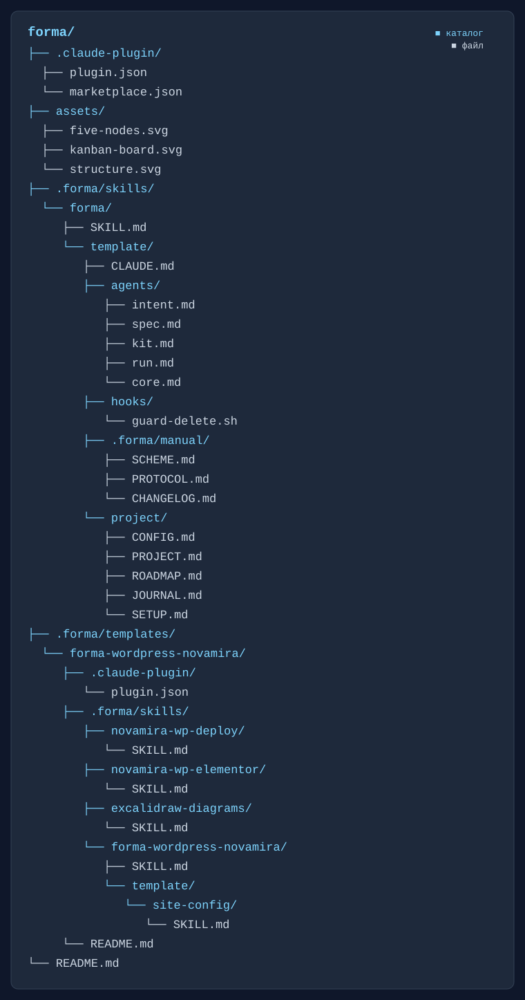

# Форма

Claude Code плагин: пятиузловой протокол управления проектом — `Intent` (замысел), `Spec` (нарезка), `Kit` (снаряжение), `Run` (исполнение), `Core` (вердикт круга). Пять узлов сами по себе не имя — форма, через которую проходит любой конкретный проект со своим именем.

## Проблема, на которую отвечает протокол

Агент, работающий один на длинной дистанции в одном непрерывном контексте, не ломается резко — он тихо вырождается: накопленный контекст подменяет проверку по факту впечатлением «обычно всё в порядке», ранние решения незаметно смещают следующие, а выполнение постепенно съезжает от исходного замысла к чему-то похожему, но не тому же самому. Это не гипотеза — это проблема, над которой сейчас активно работают и лаборатории, создающие сами модели, и все, кто строит агентные системы поверх них: как удержать агента точным не на пятой минуте, а на пятидесятом шаге.

«Форма» отвечает на это не советом «будь внимательнее», а устройством. Пять узлов — отдельные, изолированные вызовы без общей памяти между собой (см. «Кто и почему без памяти» ниже); каждая задача сверяется по записанному признаку, а не по накопленному впечатлению; ни один узел не подтверждает свою же работу. Это структурная защита именно от тихого вырождения на длинной дистанции, а не философская декларация — подробнее в «Пять пар» и `.forma/manual/en/03-forma/PROTOCOL.md`.

## Как устроена система


Четыре узла стоят по углам квадрата, пятый — в центре. По часовой стрелке: `Intent` (снизу слева) → `Spec` (нарезка) → `Kit` (снаряжение) → `Run` (исполнение) → обратно к `Intent` (сверка каждой задачи) — прямой ход круга, сплошные линии.

Пунктирные жёлтые — возвраты, у каждого своя точная причина, не общее «не получилось»: `Spec → Intent`, если непригоден сам образ результата; `Kit → Spec`, если дело в карточке, а не в снаряжении; `Run → Kit`, если не хватает пункта формы; и отдельно — `Intent → Kit`, если сверка не прошла (внешний контур в обход всей цепочки, не через `Run`). Прямого возврата в `Run` не существует ни при каких обстоятельствах: даже когда диагноз называет его, карточку пересобирает `Kit`.

`Core` — в центре не для симметрии, а потому что он вне этого контура: тонкий пунктир связывает его со всеми четырьмя, но включается он только по двум поводам за круг — нарушен порог, или круг закрылся целиком. Выносит вердикт «дошли/не дошли» — и снова уходит в тень.

## Почему именно так

**Один агент, делающий всё, не может проверить сам себя.** Первый и самый жёсткий запрет протокола — «не подтверждать свою работу самому». Если один и тот же процесс придумывает образ, режет его на задачи, снаряжает исполнителя и потом же решает, дошёл ли он до цели — его убеждённость в собственной правоте ничего не весит: некому её оспорить. Пять узлов — не бюрократия ради бюрократии, а буквальная реализация этого запрета: каждый следующий узел получает *чужой* результат и обязан о него споткнуться, если тот неполон.

**У каждого узла — своя пара критериев, и своя цена за то, что вторая половина потеряна.**

| Узел | Принимает круг по | Держит | Теряет, если пара распалась |
|---|---|---|---|
| `Intent` | красиво | справедливость | обобщение |
| `Spec` | просто | совершенство | опущение |
| `Kit` | естественно | закон | искажение |
| `Run` | честно | человечность | подмена |
| `Core` | индивидуально | истинный путь | карта не территория |

Первое слово — то, чем узел судит один конкретный круг: образ либо цепляет, либо нет; карточка либо читается без пояснений, либо нет. Второе слово — то, что решает, устоит ли это и в следующий раз, а не только сейчас. Разница между ними и есть причина, почему нужно пять узлов, а не один: **каждая потеря в момент своего совершения выглядит разумной**. Обобщение — как удачная аналогия. Опущение — как желанная краткость. Искажение — как находчивый перевод замысла в практику. Подмена — как смекалка, когда чего-то не хватает. Ни один из этих сбоев не ощущается ошибкой изнутри — он ощущается решением. Отдельный узел с собственной, узкой квалификацией — единственная защита, которая не зависит от того, заметит ли исполнитель свой же сдвиг.

**`Intent` без памяти между сверками — не баг, а условие честности.** Если бы `Intent` помнил, что последние три проверки прошли гладко, четвёртая сверялась бы уже не с признаком, а с ожиданием, что «обычно всё в порядке» — то самое тихое привыкание к провалу или к успеху, которое незаметно подменяет факт впечатлением.

**`Core` стоит в стороне не потому, что он умнее остальных, а потому, что у него нет ставки в результате.** Он не предлагает своего содержания — только чинит оснастку того узла, который назван причиной несоответствия, и снова уходит. Тот, кто одобрил образ, не может быть и тем, кто его непредвзято принимает: это разные роли, и попытка совместить их в одном месте возвращает систему туда же, откуда она ушла — к самоподтверждению.

**Итог не про контроль ради контроля.** Пять узлов существуют затем, чтобы разрыв — обобщённый образ, недорезанная задача, неверно понятый инструмент, тихая подмена — был пойман тем, кто по своей роли обязан на него среагировать, а не тем, кто надеется, что в этот раз пронесёт.

## Карта — не территория

Четыре потери из таблицы выше — не абстракция ради красивого списка. Вместе они отвечают на классический вопрос «карта — не территория»: **признак прибытия** — единственная точка, которой карта (описание задачи) привязана к территории (тому, что реально должно получиться). Пока он один и однозначен, расхождение между картой и территорией видно и измеримо.

Убери его — и обобщение, опущение, искажение и подмена начинают копиться необнаруженными. Каждый шаг сам по себе мал и правдоподобен — «что-то вроде дашборда», часть выписана, связь выпала, перевод в оснастку сменил род, пробел закрыт похожим — а вместе они рисуют карту, по которой приходят не туда. Хуже всего то, что **прибытие не туда выглядит как прибытие**: все задачи закрыты, все сверки пройдены, никто по отдельности не солгал — а результат не тот. Отсюда и вердикт круга: единственное место, где вещь сличают с образом целиком, а не складывают из пройденных по отдельности проверок частей.

### Триада каждого узла

Критерий приёмки («красиво», «просто», «естественно», «честно», «индивидуально») судит уже законченную работу — годится она или нет. Но у каждого узла есть ещё и триада — три слова, задающие направление самого действия, пока оно ещё идёт, а не после:

| Узел | Триада |
|---|---|
| `Intent` | Контекст · Память · Намерение |
| `Spec` | Причина · План · Приспособиться |
| `Kit` | Соединять · Выполнять · Доставлять |
| `Run` | Думать · Решать · Действие |
| `Core` | Одно намерение · Много · Агенты |

Триада не пересказывает роль узла (она уже описана выше) — она называет то, чем узел держит курс внутри одного захода, от первого касания задачи до передачи дальше. Критерий проверяет результат постфактум; триада — это то, что несёт узел, пока результата ещё нет.

### Два полюса и намерение

Пятеро узлов делятся ещё в одном разрезе, поперёк маршрута: `Intent` и `Spec` держат **форму** задачи (образ, признак, нарезка — как карточка устроена), `Kit` и `Run` держат **содержание** (снаряжение, действие — чем карточка занята на самом деле). `Core` — вне обоих полюсов: не производит ни формы, ни содержания, а судит их совпадение целиком.

Ни одна половина сама по себе задачу не делает. Форма без содержания — пустая карточка, признак без снаряжения; содержание без формы — работа без адреса, снаряжение, которое некуда приложить. Система оживает в момент их соединения: когда карточка, нарезанная `Spec` и принятая `Intent`, встречает своё наполнение от `Kit` и действие от `Run`. Это соединение протокол называет **намерением** — не путать с узлом `Intent` (буквы совпали, предмет разный: узел — один из пяти, намерение — то, что происходит между двумя полюсами, когда все пятеро сработали вместе). Это не шестой узел и не третий слой рядом с движком и делом — это состояние, в которое переходит уже нарезанная и снаряжённая задача, когда обе её половины сошлись.

### Как рождается цель

Протокол не начинает с готового ТЗ и не начинает с воодушевления без формы — оба пути тупиковые: сухая спецификация даёт технически рабочую, но безжизненную вещь; голая эйфория («сделаем лучший в мире сервис») разбивается о первое же техническое препятствие. Цель формируется структурно, до первой открытой карточки, тем же принципом, каким устроен весь протокол: ни одна оптика не подтверждает саму себя.

**Интервью** (`grilling`, ведёт `Intent`) достаёт из разговора все пять слов «Пяти пар» — образ, суть, личный мотив, забота о результате, и естественность (что уже происходит в жизни человека, из чего это следует «само собой», почему именно так) — обычными вопросами, не называя, какое качество ловится каждым. **Взгляд узлов**: цельный бриф отдельно читают `Spec`, `Kit`, `Run` и `Core` — каждый своей компетенцией, без чужого прочтения перед глазами, тем же изолированным вызовом, что и на производстве. Когда появляется карта проекта, дизайн-система (или её эквивалент для нужного типа проекта) и одобренный человеком прототип — не раньше — **`Kit` собирает комплектацию**: цели-кандидаты, что нужно под каждую, содержательные эпики, предварительный арсенал узлов, черновую структуру документации, и то, чего в брифе не хватает, с разбором, кто это добирает — сам `Kit` разведкой, или только человек.

Это не произвольный набор исходных данных — это та же структура, которой протокол потом судит саму работу, применённая на шаг раньше, к замыслу цели. Отсюда цель получается не абстрактной, а измеримой с самого начала: у неё уже есть признак прибытия, проверенный пятью независимыми оптиками, а не придуманный задним числом под уже сделанное. Та же мысль, что и у Карпаты для одного агента — ставить цели, которые реально достижимы, а не фантастические — здесь не пожелание, а конструкция: цель не считается сформированной, пока не прошла именно этот прогон.

Полная процедура — `.forma/manual/en/03-forma/PROTOCOL.md`, «Взгляд каждого узла на бриф»; `.forma/manual/en/03-forma/KITTING.md`; шаги 1b/10b в проектном `SETUP.md`.

### Кто и почему без памяти

| Узел | Память между вызовами | Что подаётся на вход |
|---|---|---|
| `Intent` | **есть** | образ результата держится в одной непрерывной сессии, не сбрасывается |
| `Spec` | нет | кэш круга |
| `Kit` | нет | кэш круга + карточка + названное расхождение |
| `Run` | нет | кэш круга + снаряжённая задача |
| `Core` | нет | кэш круга + запись остановки |

**`Intent` — единственный узел с настоящей памятью, и это не исключение из правила, а другое устройство.** `Spec`, `Kit`, `Run` и `Core` — отдельные агенты, вызываемые через Agent tool изолированным заходом на каждую задачу: у вызова физически нет доступа ни к чужому контексту, ни к своим же прошлым вызовам, он стартует с чистого листа и заканчивается вместе с результатом. `Intent` устроен иначе: он не вызывается отдельным заходом — держит образ результата и ведёт сверку напрямую в одной непрерывной сессии с человеком, от открытия цели до закрытия. Технически он ничего не забывает: ни предыдущих сверок, ни разговора целиком.

### Чем растёт каждый узел без памяти модели

Отсутствие памяти в модели не означает отсутствие роста: каждый узел копит опыт в своём файле, и читает именно его, а не воспоминание.

| Узел | Копит через | Что именно | Когда пишет |
|---|---|---|---|
| `Intent` | `JOURNAL.md`, `ROADMAP.md` «Что дали закрытые цели» | пять чисел круга, «Чего не хватало», качественный итог цели | при закрытии круга / цели |
| `Spec` | `project/VALUE.md` | сумма заходов и токенов по карточкам закрытой цели (`tally.cjs` — не пересчитывает вручную) | при закрытии цели — задним числом, не во время нарезки |
| `Kit` | `project/CONFIG.md`, `.claude/skills/` | лог оснастки и технических контрактов среды + оформленные умения — тот самый арсенал, который сам же читает первым делом на снаряжении | по мере находок |
| `Run` | `project/docs/`, «Результат» карточки | короткая запись на каждое видимое дело — следующий заход того же профиля читает `docs/` первым, не переоткрывает с нуля | по завершении задачи рода «дело» |
| `Core` | ничего не пишет отдельно — сводит чужие записи | тренд по хвосту `JOURNAL.md`, `VALUE.md`, «Оформленные умения» (растёт ли список между кругами) | на закрытии круга / по нарушенному порогу |

Разница с памятью модели принципиальная: файл читает не только сам узел в следующий раз, но и любой другой узел, и человек — а воспоминание модели не может прочитать никто, кроме неё самой.

**Отдельно к вопросу, видит ли `Spec` расход, когда режет задачи: пока нет.** `VALUE.md` — сводка постфактум, на закрытии уже сделанной цели, не входной сигнал для будущей нарезки. Сейчас `Spec` не смотрит на «сколько обычно стоят задачи такого профиля» перед тем, как резать новые — было бы отдельным расширением схемы, не тем, что она уже умеет.

**Поэтому на поштучной сверке беспамятность `Intent` — не факт среды, а дисциплина, которую он сам на себя накладывает.** Каждую задачу он сверяет намеренно только по записанному в карточке признаку готовности, а не по тому, какими были последние проверки: если бы он опирался на память о них, четвёртая сверка шла бы уже не с признаком, а с ожиданием «обычно всё в порядке» — то самое незаметное подслащивание факта впечатлением. Отсюда и его триада — **Контекст · Память · Намерение**: он единственный, кому вообще есть что удерживать и от чего отказываться каждый раз заново.

Зачем нужна именно беспамятность, а не «умный» накопительный контекст: узел, помнящий, что похожее уже принимали, начинает принимать по образцу, а не по признаку — тот же тихий отказ, что и везде в этой схеме: всё исправно, мерка подменена. Рост системы при этом не теряется — он живёт не в памяти агента, а в растущих файлах (`JOURNAL.md`, реестр целей), которые читаются заново каждый раз, и потому проверяемы, а не являются чьим-то непроверяемым ощущением.

## В сравнении: Karpathy Guidelines

[Andrej Karpathy сформулировал](https://x.com/karpathy/status/2015883857489522876) четыре поведенческих правила против типичных ошибок LLM-агента при написании кода (упакованы скиллом `karpathy-guidelines`): думать, прежде чем писать код — не молчать про неясность, называть допущения; простота прежде всего — минимум кода, ничего сверх спрошенного; хирургическая правка — трогать только то, что нужно, не улучшать соседнее; выполнение через цель — определить проверяемый критерий готовности и не останавливаться, пока он не выполнен.

Диагноз точный. Но все четыре адресованы **одному и тому же процессу** — тому же, что пишет код, предлагается ещё и следить за собой: не додумывать, не разрастаться, не трогать лишнее, честно мерить готовность. Это и есть тот самый случай, который в этом протоколе запрещён первым пунктом: узел, проверяющий сам себя. Дисциплина, обращённая на себя же, держится, пока не появится соблазн — а решение, подходящее под один из четырёх пунктов, в момент принятия не ощущается нарушением, оно ощущается разумным выбором (см. выше, «каждая потеря выглядит разумной»).

Форма не заменяет эти четыре правила — она берёт ровно те же четыре заботы и вместо того, чтобы просить один процесс удержать все разом, поручает каждую отдельному узлу, с чужим результатом перед глазами, а не со своим:

| Правило Карпати | Узел, который это держит | Как именно |
|---|---|---|
| Простота прежде всего | `Spec` | нарезка отдельным узлом от того, кто исполняет: «просто» и «позитивная нарезка» — не самоограничение исполнителя, а форма, которую он получает уже готовой |
| Думать, прежде чем писать код | `Kit` | «изучи все тонкости дела и снаряди так, чтобы исполнителю осталось начать, не преодолевая ничего лишнего» — думает не сам исполнитель на ходу, а тот, кто готовит для него роль, умение, инструмент, доступ, данные и модель заранее, до первой строчки кода |
| Хирургическая правка | `Run` | «делаешь по признаку, а не максимально качественно» — работа сверх заданного считается таким же отказом, как недоделанная; но проверяет это не сам `Run`, а `Intent`, читая «Результат» отдельно от его самоотчёта |
| Цель + проверка до конца | `Intent` | держит образ результата и признак прибытия с самого открытия круга, сверяет по нему каждую задачу без памяти о прошлых сверках, и по итогу сам решает — по вердикту `Core`, а не по своей оценке — открывать следующий круг или цель закрыта |
| — сверх четырёх правил | `Core` | не пишет, не режет, не снаряжает и не исполняет — читает тренд по нескольким кругам (доля сверок с первого раза, заходы сверх бюджета, расход) и балансирует нагрузку по всей цепи: недооснащённому узлу поднимает тир или добавляет умение, переоснащённому — понижает, не ослабляя признак; вступает только при нарушенном пороге или закрытии круга |

Четвёртое правило Карпати — «loop until verified» — не говорит, **кем** проверено. В одном агенте verified неизбежно означает «я сам решил, что дошёл». Здесь удержание цели и её проверка — работа одного узла, `Intent`, но не того же, кто исполняет: он не пишет код и не режет задачи, только держит образ и сверяет чужой результат с ним.

**Это не только про распределение обязанностей — у каждого узла разный, буквально прописанный набор инструментов** (`tools:` во фронтматтере агента), и превысить свои полномочия физически нечем. `Spec` и `Core` не имеют ни `Bash`, ни единого MCP-инструмента — только чтение и запись файлов: ни тот, ни другой не может выполнить код мимо своей роли, даже если бы захотел. `Kit` получает `Bash` только на управление плагинами и браузер только на разведку — не то, что меняет продукт. Инструмент, который реально что-то делает с продуктом, ставится только в снаряжение `Run`, и только на время его задачи. Правило Карпати «не трогай лишнее» в одном агенте держится решением этого же агента; здесь оно держится тем, что у трёх из пяти узлов физически нет средства его нарушить.

У четырёх правил Карпати нет аналога последней строки вовсе — ни отдельного незаинтересованного судьи (решение «дошли/не дошли» там неотделимо от того же процесса, что оценивал сам себя), ни того, кто вообще смотрит на нагрузку по цепи целиком, а не на одну задачу. Чем крупнее задача, которую человек ставит `Intent`, тем больше она растекается дальше — больше резать `Spec`, больше снаряжать `Kit`, больше исполнять `Run`; сама по себе цепь не самобалансируется, она склонна проседать там, где узел слабее задачи. `Core` — единственный, кто это видит раньше, чем перекос станет отказом.

## Язык схемы — английский, пояснение — русское

Файлы схемы (`AGENTS.md`, §8 движков, роли узлов, слой «по требованию» `on-demand/`) пишутся на английском — языке, на котором модель рассуждает и обучена плотнее всего. Пояснение, почему каждое правило сформулировано именно так, — на русском, в `.forma/manual/`. Четыре причины, почему это не косметика:

1. **Родной язык модели дешевле.** ~39% экономии токенов на тот же смысл (измерено на реальных абзацах схемы) — экономия умножается на каждый вызов каждого узла, в каждом круге, до конца жизни проекта.
2. **Промпты внутри системы пишут агенты для агентов.** Схема — не человек, выдающий инструкции напрямую: `Spec` формулирует признак для `Kit`, `Kit` пишет запрос модели для `Run`. Когда эта внутренняя переписка идёт на родном для модели языке с самого источника, часть смысла не размывается на границе перевода.
3. **Основные искажения физически разделены по разным узлам, а не только устранены языком.** Обобщение, опущение, искажение, подмена (таблица «Пять пар» выше) — в обычной, неразделённой работе все четыре происходят в одном потоке рассуждения и потому не видны до конца дела. Схема разносит их по разным узлам с разной квалификацией: потерю одного обязан поймать следующий, чья проверка устроена иначе.
4. **Механизм одинаково точен на малой задаче и на крупном мультиагентном проекте — с оговоркой.** Масштаб не меняет протокол, растёт число `Run`-раннеров внутри той же формы. Открытый вопрос — оркестрация: состыковка результатов множества параллельных исполнителей друг с другом при росте масштаба этой схемой отдельно пока не проработана.

Файлы схемы устроены четырьмя уровнями по частоте реального чтения, не по удобству:

| Уровень | Файлы | Кто читает | Когда |
|---|---|---|---|
| 1 | `AGENTS.md` (+ §8 своего движка: `CLAUDE.md` либо `.claude/rules/claude-8.md` / `.agents/rules/gemini-8.md`) | все пять узлов | каждый вызов, без исключения |
| 2 | `agents/*.md` (+ `on-demand/*.md` внутри — по редкому событию) | конкретный узел | каждый вызов именно этого узла |
| 3 | `.forma/manual/`, `project/CONFIG.md`, `project/PROJECT.md`, `project/ROADMAP.md` | узел, которому нужен конкретный факт | по обращению |
| 4 | `GOAL.md` текущей цели, карточка, `.forma/skills/*/SKILL.md` | узел, работающий именно с этой целью/задачей | по событию, ещё у́же уровня 3 |

Полный разбор — `.forma/skills/forma/core/.forma/manual/en/03-forma/PROTOCOL.md`, «Язык схемы и язык объяснения — разные роли, не одно и то же», и `.forma/skills/forma/core/.forma/manual/en/03-forma/SCHEME.md`, «9. Уровни чтения схемы».

## Как это работает в проектном управлении


Те же пять узлов, но не по кругу, а привычной доской: `Spec` — входящий лог, карточка ещё не взята в работу; `Kit` — определение, задача снаряжена и готова к исполнению; `Run` — процесс, исполнение идёт; `Intent` — готово, задача сверена и принята. `Core` не в ряду колонок — он снизу, под всеми четырьмя: не задача и не этап, а предел, который держит и связывает их разом и решает, состоялся ли круг, а не смотрит на одну карточку.

## Установка

**Коротко — два способа:**

```
# из папки целевого проекта (Node 18+, npm не нужен как реестр — ставится прямо с GitHub)
npx github:IamForma/forma init

# или плагином Claude Code
claude plugin marketplace add IamForma/forma
claude plugin install forma@forma
```

`npx github:IamForma/forma init` ставит ядро (`AGENTS.md`, доска, дашборд, `.forma/manual/`), затем спрашивает движки (Claude — готов), шаблон проекта и Kanban Markdown. Повторный запуск — обновление: конфигурация схемы перезаписывается, `project/`, доска и `.forma/living/` не трогаются. В реестре npm пакета нет — имя `forma` там занято чужим пакетом, поэтому только `github:`.

Ниже — подробности и путь через git-клон.

«Форма» — не голый набор файлов в корне, а **скилл-инсталлятор**: `.forma/skills/forma/SKILL.md` — пошаговая инструкция, которая копирует шаблон (`AGENTS.md` — закон протокола одним файлом на все среды — плюс §8 своего движка: `CLAUDE.md` в корне или, если корень решено держать чистым, `.claude/rules/claude-8.md`, который Claude Code читает сам, и `.agents/rules/gemini-8.md`, пять ролей-агентов для обеих сред + хуки (в том числе оповещение о новой версии плагина на старте сессии) + каркас `project/` + живой дашборд доски) в целевой проект как обычные файлы. Двух способов доставить эту инструкцию до целевого проекта — два, оба ведут к одному и тому же скиллу.

### Способ 1 — git-клон (рекомендуется)

Надёжнее плагинного: `claude plugin marketplace update` на практике иногда обновляет номер версии, но не содержимое файлов — кэш не инвалидируется. Git этой проблемы не имеет в принципе.

```
cd целевой-проект
git clone https://github.com/IamForma/forma.git protocol
```
(Клон лежит **внутри** целевого проекта, в `целевой-проект/.forma/protocol/` — так же, как в проекте, где протокол разрабатывается. Имя `.forma/protocol` в конце команды обязательно: без него папка назовётся `forma/`. Для репозитория проекта `.forma/protocol/` — вложенный репозиторий: его файлы в историю проекта не попадают.) Дальше в сессии, открытой в целевом проекте, просто попросите:

```
прочитай .forma/protocol/.forma/skills/forma/SKILL.md и установи по нему протокол Форма
```

Никакой регистрации как Claude Code-плагина не требуется — это просто markdown-инструкция, агент читает и выполняет её шаги напрямую (`Read`/`Write`/`Bash`), тем же порядком, каким пользуется любой другой человек, ведущий сессию.

**Обновление** — тем же путём: `git -C protocol pull`, затем в сессии «обнови протокол Форма» (или прочитать `SKILL.md` заново — он сам синхронизирует только конфигурацию схемы и не тронет `project/`, см. `SKILL.md`, шаг 1).

**Шаблон проекта при способе 1.** Шаблоны уже лежат в клоне — `.forma/protocol/.forma/templates/<имя>/`, отдельно ничего качать не нужно. Но без регистрации плагина их скиллы сами не активны, поэтому установка — два шага в сессии целевого проекта, после установки протокола:

```
скопируй скиллы из .forma/protocol/.forma/templates/forma-wordpress-novamira/.forma/skills/ в .claude/skills/ (кроме forma-wordpress-novamira)
прочитай .forma/protocol/.forma/templates/forma-wordpress-novamira/.forma/skills/forma-wordpress-novamira/SKILL.md и установи по нему шаблон проекта
```

Первая строка делает рабочие скиллы шаблона проектными (то, что при способе 2 даёт сам плагин); вторая — выполняет установщик шаблона (маршрут `project/ROUTE.md`, заготовка `site-config`), пути `template/…` в нём читаются от его собственной папки. Обновление — `git -C protocol pull` и те же две строки; установщик не перезапишет заполненные `ROUTE.md`/`site-config` без вопроса.

### Разработка протокола из любого проекта (для автора)

Любой проект, установленный способом 1, может не только получать протокол, но и развивать его: `.forma/protocol/` — полноценный клон `IamForma/forma`, пуш из него идёт в главный репозиторий. Нужны права на запись в `IamForma/forma`; у обычного пользователя их нет, и для него этот раздел ничего не меняет.

**Где что лежит.** Движок работает из файлов проекта, исходник — в `.forma/protocol/.forma/skills/forma/`: ядро (одно для всех движков) — `core/`, адаптеры движков — `adapters/<движок>/` (`claude` — готов; `codex`, `gemini` — «не готов», `NOT-READY.md`):

| В проекте (работает) | В исходнике (коммитится) |
|---|---|
| `.claude/agents/`, `.claude/hooks/`, `.claude/rules/`, `.claude/scripts/`, `.claude/skills/` | `.forma/protocol/.forma/skills/forma/adapters/claude/agents/`, `hooks/`, `rules/`, `scripts/`, `.forma/skills/` |
| `AGENTS.md` | `.forma/protocol/.forma/skills/forma/core/AGENTS.md` |
| `.forma/dashboard/`, `.forma/manual/` | `.forma/protocol/.forma/skills/forma/core/.forma/dashboard/`, `.forma/manual/` |
| `.forma/skills/` (интервью `grilling`, `forma-grill-with-ui`), `.forma/board/` (`new-card.cjs`, `check-board.cjs`, `DATA-MODEL.md`), `.devtool/features/` | `.forma/protocol/.forma/skills/forma/core/.forma/skills/`, `core/.forma/board/`, `core/.devtool/features/`; `.claude/skills/<интервью>` — копия, доставленная адаптером, в исходник не идёт |
| — | сам инсталлятор, шаблоны, README: `.forma/protocol/.forma/skills/`, `.forma/protocol/.forma/templates/`, `.forma/protocol/README.md` |

`project/` и `.forma/living/` в исходник не переносятся никогда — это содержимое и история конкретного проекта. Проектные скиллы (которых нет в шаблоне) — тоже нет.

**Адаптер для нового движка** (Codex, Gemini) — `docs/ADAPTER.ru.md` (en — `docs/ADAPTER.md`): граница ядро/адаптер, семь пунктов сверки, критерий «готов». В проекты не устанавливается.

**По умолчанию — одной командой:** `node .forma/protocol/scripts/forma-commit.cjs "что сделано" [--push]`. Делает шаги 2–6 ниже подряд: Claude → Gemini/Codex (`sync-engines --apply`, `sync-codex --apply`), проверка паритета, перенос в `template/`, `templates-gemini/`, `templates-codex/`, patch-версия, коммит `.forma/protocol/` и `--mark`, коммит проекта (`git add -A`); с `--push` — `pull --rebase`, `--before-push`, push. Останавливается на дрейфе, конфликте или правке, которая есть только в шаблоне. `--check` — только проверка; `--install-hook` ставит её в `.git/hooks/pre-commit`, и коммит с дрейфом движков не проходит.

**Цикл правки (вручную):**

1. Правка в движке проекта (например, `.claude/agents/kit.md`) — проверена в работе.
2. Перенос в исходник: `node .forma/protocol/scripts/engine-to-protocol.cjs` — показывает классификацию, ничего не пишет; `--apply` переносит «изменён только движок»; новый файл — явно, `--add <путь>`. Нет `.forma/protocol/.git` — скрипт останавливается: механизм только для автора.
   - **Направление — по git, не по времени файлов** (после `clone`/`checkout` все файлы шаблона «новее» — mtime врёт). База — коммит `.forma/protocol/`, на котором движок и шаблон последний раз совпадали; хранится в `.forma/protocol/.git/forma-base` (вне истории, у каждого клона своя). Три содержимого: база B, шаблон сейчас H, движок E. E≠B, H=B — изменён только движок → переносится; E=B, H≠B — изменён только шаблон → «обнови протокол Форма» (шаг 7); оба → конфликт, решает человек.
   - База пишется командой `--mark` — после коммита переноса и после каждого обновления движка из шаблона. `--mark` отказывает, если движок и шаблон где-то расходятся или в шаблоне незакоммиченное: ложная база хуже отсутствующей.
   - Базы нет (первый запуск, новый клон) — выводится по истории файла: движок равен какой-то версии шаблона → изменён только шаблон; не равен ни одной → база оценивается по ближайшей версии (помечено «оценка»); ближайшая не HEAD → конфликт, решает человек.
   - **Исключения** — `.forma/protocol/scripts/engine-to-protocol.exceptions`. `skip <regex пути>` — мусор и проектное (`.tmp-*`, `*-card-NNN.sh`, `.plugin-check-stamp`, `.codex-verified.json`, логи): не сравнивается, не переносится. `mask <путь> <regex строки>` — намеренное отличие обезличивания (`model:`, `tools:` с MCP проекта, имя проекта, примеры имён скиллов): строки маскируются с обеих сторон, файл, отличающийся только ими, показывается как «не дрейф», а при переносе в шаблон остаётся строка шаблона. Новое намеренное отличие — строка `mask` в этот файл.
3. Версия: `.forma/protocol/.claude-plugin/plugin.json` — следующий patch.
4. Коммит в клоне: `git -C protocol add -A && git -C protocol commit -m "<версия>: <что изменено>"`, затем `node .forma/protocol/scripts/engine-to-protocol.cjs --mark`.
5. Перед пушем — забрать чужое: `git -C protocol pull --rebase`.
   - нового нет — сразу шаг 6;
   - пришли правки из другого проекта — ваш коммит встаёт поверх них сам;
   - конфликт — `pull` останавливается; решить вручную (или попросить агента показать обе стороны), затем `git -C protocol rebase --continue`. Конфликт номера версии в `plugin.json` решается так: берётся следующий patch **после** пришедшего.
   - **одинаковый номер версии на обеих сторонах git сливает молча** — строки совпали, конфликта нет, и два выпуска получают один номер. Поэтому перед пушем: `node .forma/protocol/scripts/engine-to-protocol.cjs --before-push` — останавливается, если версия не выше опубликованной или ветка отстала.
6. `git -C protocol push`.
7. Во всех остальных проектах: `git -C protocol pull`, затем «прочитай .forma/protocol/.forma/skills/forma/SKILL.md и обнови по нему протокол Форма» (шаг 1 SKILL.md перезаписывает конфигурацию схемы из шаблона) — иначе клон обновится, а движок в `.claude/` останется старым. После обновления — `node .forma/protocol/scripts/engine-to-protocol.cjs --mark` (если автор). Путь назван явно: если в среде стоит ещё и плагин `forma`, короткое «обнови форму» может взять его кэш, а не свежий клон.

Пуш — только когда автор сам решил, что правка готова; агент не пушит по своей инициативе.

### Способ 2 — плагин Claude Code

```
claude plugin marketplace add IamForma/forma
claude plugin install forma@forma
# в проекте, куда ставите протокол:
"установи протокол Форма" (или /forma)
```

(то же самое из работающей сессии — `/plugin marketplace add IamForma/forma`, затем `/plugin install forma@forma`.)

На практике этот путь ловил как минимум один воспроизведённый баг обновления кэша (версия `plugin.json` менялась, содержимое `SKILL.md` в кэше — нет) — если обновлённое поведение не появляется после `marketplace update`, не тратьте время на диагностику кэша: переходите на способ 1.

Подробности процедуры — `.forma/skills/forma/SKILL.md`.

## С чем ставить вместе

Сам плагин ничего из этого не тянет за собой автоматически: у Claude Code нет способа поставить VS Code-расширение, а настоящая plugin-зависимость (`dependencies` в `plugin.json`) включается насовсем — отключить её отдельно, пока «Форма» включена, нельзя. Поэтому ниже — не автоматика, а список: что нужно, и что просто пригодится.

**Обязательно — без этого протокол не заводится, не просто «неудобно без визуала».** `AGENTS.md` §7 описывает статус карточки в `.devtool/features/` — это единственное место, куда стекается вся история, результат, статистика и опыт всех пяти узлов (`.forma/manual/en/03-forma/ZONES.md`, зона 3). Без физической доски поверх этих файлов дашборду и графу неоткуда брать данные, `Intent` не может сверить критерий, `Kit` не может снарядить по фактам — рушится субстрат, не просто эстетика. Расширение VS Code [Kanban Markdown](https://marketplace.visualstudio.com/items?itemName=LachyFS.kanban-markdown) — наш текущий выбор технологии для этой обязательной функции (сам принцип фиксирован, конкретное расширение — сменная деталь): карточку видит и правит и человек, и любой узел, никакого отдельного хранилища.

```
code --install-extension LachyFS.kanban-markdown
```

**По желанию, для самого протокола:**

| Плагин | Зачем именно с «Форма» | Установка |
|---|---|---|
| `skill-creator` | Когда `Kit` проектирует умение весом больше одной узкой задачи — полный цикл черновик → тестовые промпты → evals → правки, вместо ручного `SKILL.md` | `claude plugin install skill-creator@claude-plugins-official` |
| `context-mode` | Песочница для разведки и обработки данных в стороне от разговора — особенно кстати `Spec`/`Core`, у которых из инструментов только чтение и запись файлов: посчитать/отфильтровать, не затаскивая сырые данные в свой узкий контекст | `claude plugin marketplace add mksglu/context-mode`<br>`claude plugin install context-mode@context-mode` |
| `agentmemory` | Память между сессиями — не путать с намеренной беспамятностью `Intent` между отдельными сверками внутри круга (`AGENTS.md`, §1, «Пять пар»): та беспамятность — про честность одной сверки здесь и сейчас, это — про то, что новая сессия не начинается с чистого листа | `claude plugin marketplace add rohitg00/agentmemory`<br>`claude plugin install agentmemory@agentmemory` |

Ни один из четырёх не проверялся в связке с «Форма» — как и сам плагин, это до первой реальной установки в отдельном проекте.

## Пять частей системы

Протокол «Форма» — не один инструмент, а пять частей, из которых три больше не ставятся порознь:

| Часть | Что это | Как ставится |
|---|---|---|
| Ядро | закон (§1–7), пять ролей-агентов, хуки, служебные скрипты, документация схемы, каркас `project/` | плагин `forma` |
| Дашборд | локальный интерфейс расхода/оснастки узлов + граф знаний (`graphify`) одной вкладкой, не отдельным окном | тем же плагином `forma`, вторым вызовом не требуется |
| Интервью | терминальный скилл `grilling` и браузерная страница `forma-grill-with-ui` — `Intent` выбирает между ними сама | тем же плагином `forma` |
| Шаблон проекта | готовый маршрут под конкретный тип дела (например, `forma-wordpress-novamira` — WordPress через Novamira MCP) | **отдельно, выбором человека** — шаблон предопределяет опыт работы, а это решение, которое протокол ещё только учится формировать и передавать, не то, что можно навязать по умолчанию |
| Канбан-доска | физическая доска `.devtool/features/`, единственное место, куда стекается статус карточек, история, результат, расход | **отдельно, вручную** — расширение редактора (VS Code/Antigravity), не плагин Claude Code: у него нет способа поставить чужое расширение, ставить это приходится человеку |

Дашборд и интервью раньше были отдельными компаньон-плагинами (`forma-dashboard`, `forma-grilling`); решение отменено, когда стало ясно, что без них протокол не работает и держать их порознь от ядра смысла нет.

## Отделяемый шаблон проекта

Каталог `.forma/templates/` держит шаблоны проектов — плагины того же маркетплейса, каждый добавляет готовую конфигурацию под конкретный тип дела и устанавливается своей командой, поверх `forma`, только если дело такого рода. Новый шаблон под другой тип проекта добавляется той же схемой — своя подпапка в `.forma/templates/`, своя строка в `plugins:` `marketplace.json`.

| Плагин | Для чего | Установка |
|---|---|---|
| [`forma-wordpress-novamira`](https://github.com/IamForma/forma/blob/main/.forma/templates/forma-wordpress-novamira/README.md) | разработка WordPress с помощью Novamira MCP (+ Elementor) с Aura/Magnific — три готовых скилла + заготовка `site-config` | `claude plugin install forma-wordpress-novamira@forma` |

Подробности — README внутри каталога шаблона.

## Версионирование

Версия в `.claude-plugin/plugin.json` (и в любом другом `plugin.json` этого же семейства — например, `.forma/templates/*/​.claude-plugin/plugin.json`) растёт **только третьим числом (patch)** — никаких скачков через minor/major без отдельного явного решения человека.

Patch-число считается **десятками, не единицами**: после `0.4.5` следующий бамп — не `0.4.6`, а `0.4.51`, потом `0.4.52`, `0.4.53` и так далее, с запасом дорасти до трёх разрядов при большом числе раундов правок. Само по себе patch-число ничем не ограничено (`0.4.9 → 0.4.10 → 0.4.11` работает без предела) — счёт десятками не техническая необходимость, а сознательный выбор, чтобы номер версии не выглядел как «мы только начали» при частых мелких правках.

**Коммит и версия развязаны — это разные вещи.** Коммит — единица истории и отката, версия — то, что видит потребитель плагина. Коммитить следует так часто, как удобно откатываться: крупный коммит теряет вместе с ошибкой всё хорошее, что попало в тот же ком. Версию поднимать **только когда для потребителя что-то изменилось** — новый файл в шаблоне, изменившееся правило, исправленное поведение. Череда коммитов под одну версию — норма, а не недосмотр; если сомневаешься, не бампать лучше, чем бампать лишний раз.

**Версия никогда не идёт назад.** Не только потому, что это неопрятно: проверка обновлений (`check-plugin-update.sh`) сравнивает «строго новее» и откат номера скрывает молча, выглядя исправной работой. Прецедент был: правка вернула файл целиком вместе с номером и откатила `0.4.93` → `0.4.91`; заметили спустя несколько версий. Возвращая файл к прежнему состоянию, номер версии из отката исключают.

Сравнение версий числовое по частям, а не текстовое: `0.4.9 < 0.4.51 < 0.4.99 < 0.4.100 < 0.4.250 < 0.5.1`. Разрядность расти может свободно — сотые ничего не ломают (проверено `sort -V`).

## Структура проекта



| Путь | За что отвечает |
|---|---|
| `.claude-plugin/plugin.json` | манифест плагина — имя, версия, описание; то, что Claude Code читает при подключении |
| `.claude-plugin/marketplace.json` | делает репозиторий маркетплейсом самого себя — без него `claude plugin install forma` не резолвится, имя плагина ищется внутри маркетплейса |
| `assets/` | картинки этого README (три SVG) — не участвуют в установке |
| `.forma/skills/forma/SKILL.md` | сам скилл-инсталлятор: пошаговая процедура установки протокола в целевой проект (проверка на конфликт, копирование, регистрация хука) |
| `.forma/skills/forma/core/AGENTS.md` | **закон протокола** — маршрут круга, формат карточки, пороги, пять пар, запреты (§1–7). Один файл на все среды, источник правды: правится только он. Копируется в корень целевого проекта как есть |
| `.forma/skills/forma/adapters/claude/rules/claude-8.md` | тот же §8 без строки импорта — для проекта, чей корень держат чистым: когда `CLAUDE.md` в корне нет, Claude Code читает проектными инструкциями и `AGENTS.md`, и всё из `.claude/rules/`. Ставится шагом 4a вместо корневой обёртки, не вместе с ней |
| `.forma/skills/forma/adapters/gemini/rules/gemini-8.md` | то же для Google Antigravity: импорт плюс своя §8 (режимы Teamwork/fallback, модели узлов) |
| `.forma/skills/forma/adapters/claude/agents/intent.md` | роль `Intent` — образ результата, интервью, сверка каждой задачи, запись |
| `.forma/skills/forma/adapters/claude/agents/spec.md` | роль `Spec` — нарезка круга на карточки задач |
| `.forma/skills/forma/adapters/claude/agents/kit.md` | роль `Kit` — снаряжение задачи: доступ, данные, умение, инструмент, модель |
| `.forma/skills/forma/adapters/claude/agents/run.md` | роль `Run` — исполнение ровно заданного, без импровизации |
| `.forma/skills/forma/adapters/claude/agents/core.md` | роль `Core` — вердикт круга, пороги, диагноз узла |
| `.forma/skills/forma/adapters/claude/hooks/guard-delete.sh` | хук, блокирующий удаление защищённых каталогов/файлов схемы без явной команды человека |
| `.forma/skills/forma/adapters/claude/hooks/check-ready.sh` | хук `SessionStart`: молча проверяет незаполненные места (агенты, пороги, карта целей, `VARS/`) при старте каждой сессии, ничего не блокирует |
| `.forma/skills/forma/core/.forma/dashboard/` | официальный инструмент арсенала — ставится в корень проекта (`.forma/dashboard/`), не в `.devtool/` (тот принадлежит Kanban Markdown): живая визуализация доски (`generate.js`/`serve.js`/`index.html`) — `node .forma/dashboard/serve.js` → `localhost:5050`, обновляется по SSE при каждой правке карточки; `watch.js`/`ensure-running.js` — самовосстановление, поднимаются `check-dashboard.sh` при падении сервера |
| `.forma/skills/forma/adapters/claude/hooks/check-dashboard.sh` | хук `SessionStart`: проверяет `localhost:5050` при старте сессии, если сервер не отвечает — поднимает супервизор `watch.js` в фоне |
| `.forma/skills/forma/core/.forma/manual/en/03-forma/SCHEME.md` | устройство схемы целиком — состав узлов, требования к среде, кэш круга, схлопывание, числа, файловое дерево; универсально, под дело не правится |
| `.forma/skills/forma/core/.forma/manual/en/03-forma/PROTOCOL.md` | обоснования правил схемы — почему так, а не иначе |
| `.forma/skills/forma/core/.forma/living/CHANGELOG.md` | журнал версий протокола |
| `.forma/skills/forma/core/project/CONFIG.md` | каркас: карта структуры проекта по девяти разделам (что пишет каждый узел) + лог оснастки, пуст |
| `.forma/skills/forma/core/project/PROJECT.md` | каркас: пороги, оснастка узлов, справочники, доступы, оформленные умения — заголовки и пустые таблицы |
| `.forma/skills/forma/core/project/ROADMAP.md` | каркас: карта целей — пуст, первая цель добавляется на подготовке |
| `.forma/skills/forma/core/project/JOURNAL.md` | каркас: журнал кругов — шаблон записи и как читать числа, записей нет |
| `.forma/skills/forma/core/project/VALUE.md` | каркас: статистика и ценность по закрытым целям — заходы (план/факт), токены, ключевая ценность, пуст |
| `.forma/skills/forma/core/project/SETUP.md` | порядок подготовки до первой цели: интервью по пяти пунктам → сверка через пять узлов → документ истории → создание целей → нарезка |

## Подготовка проекта

Универсален для этого типа проекта (лендинг + сайт). Проходится один раз, до открытия первой цели. Следующий проект этого типа наследует тот же порядок по умолчанию.

---

### Шаги

| №  | Шаг | Где | Вход | Выход |
|---|---|---|---|---|
| 1 | Бриф | здесь | интервью с человеком | `brief/interview.md`, `brief/reference.md` (первым, лёгким проходом — синтез `Intent` по ходу интервью) |
| 1b | Взгляд узлов | `Spec`, `Kit`, `Run`, `Core` — каждый отдельно, затем сведение `Kit`-ом | бриф (1) | `brief/nodes-vision.md` — четыре независимых видения брифа + сведённая `Kit`-ом оснастка |
| 2 | История | здесь | бриф (1) | `brief/history.md` — систематизированный документ: все исходные параметры интервью, структурно оформленные |
| 3 | Карта сайта | здесь | бриф (1) | `mockups/sitemap.md` |
| 4 | Prompt для landing page | здесь | история (2) | `brief/prompt.md` |
| 5 | Сбор референсов | здесь | prompt (4), карта сайта (3) | `brief/reference.md` — тот же файл, доведён до полноты: теперь известно, под что именно искать |
| 6 | Определение дизайн-системы | здесь | референсы (5) | `project/reference/design-system.md` |
| 7 | Дизайн лендинг-пейджа — формирование и доработка | формирование — снаружи, `aura.build`; доработка — здесь, локально, нашими средствами | prompt (4), дизайн-система (6) | референс-макап лендинга, доработанный (хранится на стороне `aura.build`) |
| 8 | Дизайн всех страниц сайта, по карте сайта | снаружи, `aura.build` | карта сайта (3), доработанный дизайн лендинга (7), дизайн-система (6) | референс-макап всех страниц (хранится на стороне `aura.build`) |
| 9 | Загрузка макапа | здесь | референс-макапы (7, 8) | `mockups/v<N>/` — макап всех страниц как есть, сырой |
| 10 | Доработка макапа — прототип | здесь, человеком/дизайнером | макап (9), карта сайта (3) | `mockups/v<N>/` — та же папка, исправлена и одобрена; становится прототипом всех страниц |
| 10b | Комплектация | `Kit`, по инструкции `.claude/agents/on-demand/kit-project-kitting.md` | прототип (10), бриф (1), взгляд узлов (1b), всё 2–9 | `brief/kitting.md` — цели-кандидаты, требования к ним, эпики, предварительный арсенал узлов, черновая структура документации, список доукомплектовки |
| 11 | Создание целей | здесь | всё предыдущее, включая `kitting.md` (10b) | `goals/goal-NN/GOAL.md` на сегмент; строка в `ROADMAP.md`/«Карта» |

**11 из 13 строк — карточки эпика «6. Входящие/Intent»** на доске `.devtool/features/` — исполнитель `Intent`, вне производственного маршрута. Два исключения, обе без карточки (доска ещё не существует на этой стадии): шаг **1b** — `Spec`/`Kit`/`Run`/`Core` читают бриф каждый отдельно; шаг **10b** — `Kit` сводит всё собранное в комплектацию проекта. Оба — тем же родом хозяйственного действия, что и остальные шаги Intent, просто с другим исполнителем.

Шаг 1 ведётся раундами по фронтиру — `forma-grill-with-ui`, если браузер доступен, иначе `grilling` (правило выбора — `intent-goal-opening.md`, «Эпик»), не разовым интервью. Шаг 2 продолжает его напрямую: интервью фиксирует сказанное, история приводит его в структуру — раздельно, чтобы можно было проверить, не потерялось ли что-то при систематизации.

**Шаг 1b встаёт между брифом и историей.** Бриф (1) передаётся `Spec`, `Kit`, `Run` и `Core` по отдельности, тем же изолированным вызовом, каким они вызываются на производстве: каждому — только бриф, без чужих прочтений. `Kit` сводит все четыре видения в `brief/nodes-vision.md`. История (2) и дальнейшие шаги читают бриф (1) напрямую — шаг 1b не заменяет его, он добавляет четыре независимые проверки образа до того, как на него потрачен хоть один заход.

Карта сайта (3) читает бриф (1) напрямую, не историю (2) — ей нужны только факты. Она же стоит раньше prompt'а (4) сознательно: prompt для одной страницы пишется, уже когда виден сайт целиком. Сам prompt (4) пишется по истории (2), а не по брифу — нуждается в структурированном виде, не в хронологии вопросов-ответов.

Дизайн разбит на два шага намеренно: лендинг (7) — то, что prompt (4) и дизайн-система (6) описывают напрямую; весь сайт (8) расширяется на остальные страницы карты сайта (3) уже после того, как лендинг задал язык. Шаг 7 не заканчивается формированием: доработка лендинга идёт тут же, внутри того же шага, — здесь, локально. Формирование обоих макапов (7, 8) — снаружи, на `aura.build`; их результат приносится обратно шагом 9.

Редактор — [aura.build](https://www.aura.build): тот же сайт, что `kit.md` использует как источник готовых умений. Доступ — через MCP-сервер `aura-build`: подтверждено для каталога скиллов (`aura_search_catalog`/`aura_get_catalog_source`); инструменты создания/публикации канваса (`aura_create_canvas_html`, `aura_update_canvas`, `aura_publish_project`) для самой сборки страниц отдельно не проверялись. Резерв — браузерные MCP-инструменты (`chrome-devtools`: `new_page`/`navigate_page`/`take_snapshot`/`fill`/`click`), уже данные `Intent` и `Kit`.

Шаг 10 решает человек: макап (9) либо признаётся годным и становится прототипом — фиксированной мерой для всей остальной схемы, — либо уходит на повторную доработку.

Шаг 11 наполняет и `ROADMAP.md`: из брифа — краткое резюме одной строкой в «Целое» (если ещё не заполнено); каждая решённая цель — узлом в «Карте». Дальше, когда цель реально берётся в работу, ей заводится эпик на доске (`.devtool/features/`) — это уже `Intent`, `intent.md`, «Эпик»; сама цель эпик не создаёт автоматически.

---

**Эпик «3. Форма/Intent+Kit» не привязан ни к одной цели и доступен с самого начала**, даже раньше шага 1: любой узел, упёршийся в вопрос, который решает человек, заводит туда карточку. Пред-регистрировать её не нужно — имя зарезервировано правилом, не файлом. Маркер несёт два имени плюс условное третье в скобках, потому что исполнение решает домен карточки: доступ/инструмент/скилл — снаряжает `Kit`, исполняет сам либо, если оснастка требует действия на сайте, передаёт `Run` (отсюда скобки, участие условное); файл схемы/справочника — сам `Intent`, напрямую с человеком. Все случаи — без `Spec`/`Core`.

---

Дальше — `Spec` нарезает задачи. Это уже следующий узел, вне этой подготовки.

Полная процедура — [`.forma/skills/forma/core/project/SETUP.md`](https://github.com/IamForma/forma/blob/main/.forma/skills/forma/core/project/SETUP.md).
